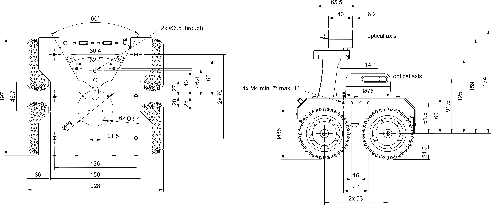

# Client Planner Python Implementation

<br>

## Setting up configuration

Move to rosbot_navigation inside rosbot_decription/src and create folder name config

```sh
cd src/rosbot_description/src/rosbot_navigation

mkdir config

cd config
```

## Robot Dimensions



## costmap_common_params

Create a new file inside config folder called costmap_common_params.yaml

```sh
code costmap_common_params.yaml
```

copy following content to it

```sh
obstacle_range: 3.0
raytrace_range: 3.5
footprint: [[0.12, 0.14], [0.12, -0.14], [-0.12, -0.14], [-0.12, 0.14]]
map_topic: map
subscribe_to_updates: true
observation_sources: pointCloud
pointCloud: {sensor_frame: camera_rgb_frame, data_type: PointCloud2, topic: camera/depth/points, marking: true, clearing: true, max_obstacle_height: 0.5, min_obstacle_height: 0.0}
global_frame: map
robot_base_frame: base_link
always_send_full_costmap: true
```

## global_costmap_params

Create a new file inside config folder called global_costmap_params.yaml

```sh
code global_costmap_params.yaml
```

copy following content to it

```sh
global_costmap:
  update_frequency: 0.5
  publish_frequency: 1.5
  transform_tolerance: 0.5
  width: 15
  height: 15
  origin_x: -7.5
  origin_y: -7.5
  static_map: false
  rolling_window: true
  inflation_radius: 2.5
  resolution: 0.01
```

## local_costmap_params

Create a new file inside config folder called local_costmap_params.yaml

```sh
code local_costmap_params.yaml
```

copy following content to it

```sh
local_costmap:
  update_frequency: 2.5
  publish_frequency: 2.5
  transform_tolerance: 0.25
  static_map: false
  rolling_window: true
  width: 3
  height: 3
  origin_x: -1.5
  origin_y: -1.5
  resolution: 0.01
  inflation_radius: 1.0
```

## trajectory_planner

Create a new file inside config folder called trajectory_planner.yaml

```sh
code trajectory_planner.yaml
```

copy following content to it

```sh
TrajectoryPlannerROS:
 max_vel_x: 0.1
 min_vel_x: 0.05
 max_vel_theta: 2.5
 min_vel_theta: -2.5
 min_in_place_vel_theta: 0.5
 acc_lim_theta: 1.0
 acc_lim_x: 1.5
 acc_lim_Y: 1.5
 holonomic_robot: false
 meter_scoring: true 
 xy_goal_tolerance: 0.1
 yaw_goal_tolerance: 0.1
 meter_scoring: true
 occdist_scale:  0.01
 pdist_scale: 0.4
 gdist_scale: 0.2
```

## launch file

Create a new file inside launch folder called navigation_demo.launch

```sh
cd ..
cd launch
```

```sh
code navigation_demo.launch
```

copy following content to it

```sh
<?xml version="1.0"?>
<launch>
  <master auto="start"/>

  <!-- Map server -->
    <node pkg="octomap_server" type="octomap_server_node" name="octomap_server" output="screen">
        <param name="resolution" value="0.05" />
        <param name="frame_id" type="string" value="/odom" />
        <param name="sensor_model/max_range" value="3.8" />
        <param name="latch" value="true" />
        <param name="filter_ground" value="true" />

        <remap from="cloud_in" to="/camera/depth/points" />
        <remap from="projected_map" to="map" />
    </node>

  <!-- Move base -->
  <node pkg="move_base" type="move_base" respawn="false" name="move_base" output="screen">
    <rosparam file="$(find rosbot_navigation)/config/costmap_common_params.yaml" command="load" ns="global_costmap" />
    <rosparam file="$(find rosbot_navigation)/config/costmap_common_params.yaml" command="load" ns="local_costmap" />
    <rosparam file="$(find rosbot_navigation)/config/local_costmap_params.yaml" command="load" />
    <rosparam file="$(find rosbot_navigation)/config/global_costmap_params.yaml" command="load" />
    <rosparam file="$(find rosbot_navigation)/config/trajectory_planner.yaml" command="load" />

    <remap from="cmd_vel" to="cmd_vel"/>
    <remap from="odom" to="odom"/>
    <remap from="scan" to="/scan"/>
    <param name="move_base/DWAPlannerROS/yaw_goal_tolerance" value="1.0"/>
    <param name="move_base/DWAPlannerROS/xy_goal_tolerance" value="1.0"/>

  </node>
</launch>
```
[<< Back to Main menu](../README.md)
